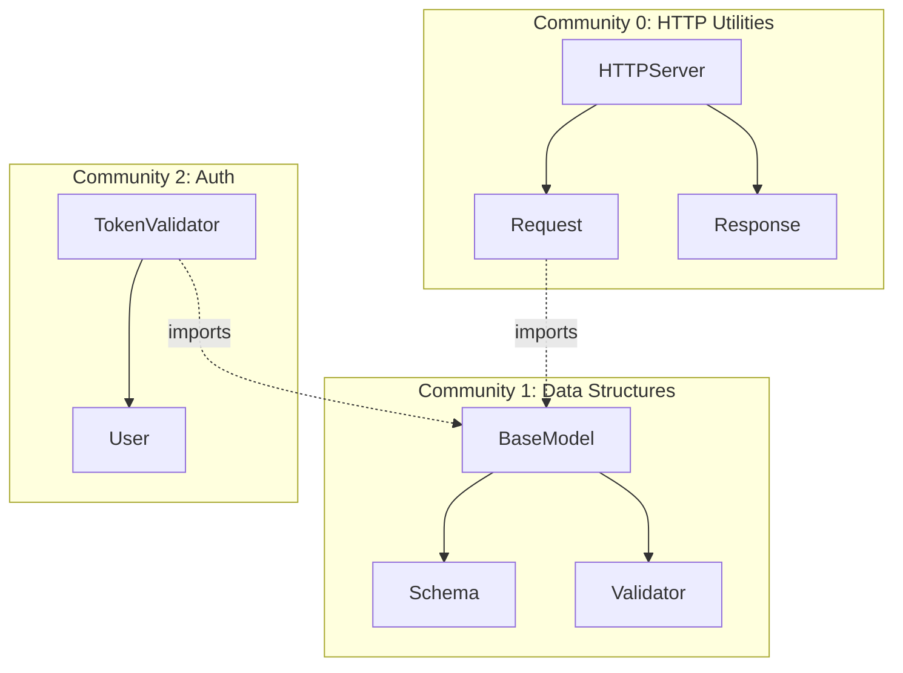
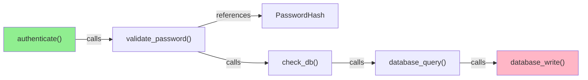
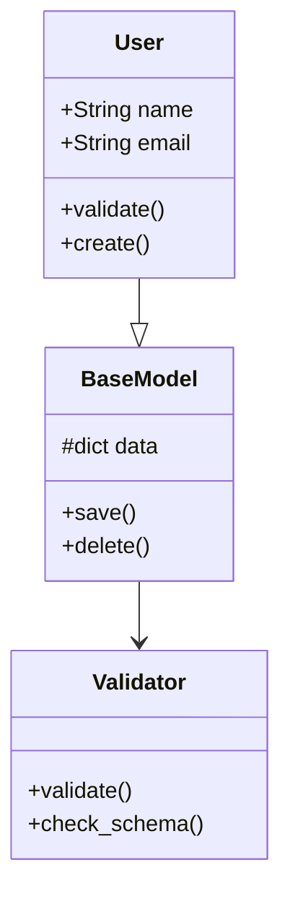
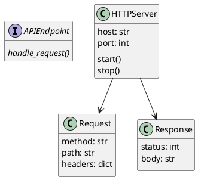
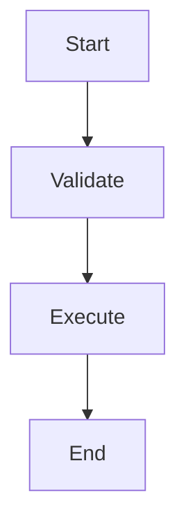
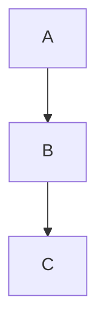
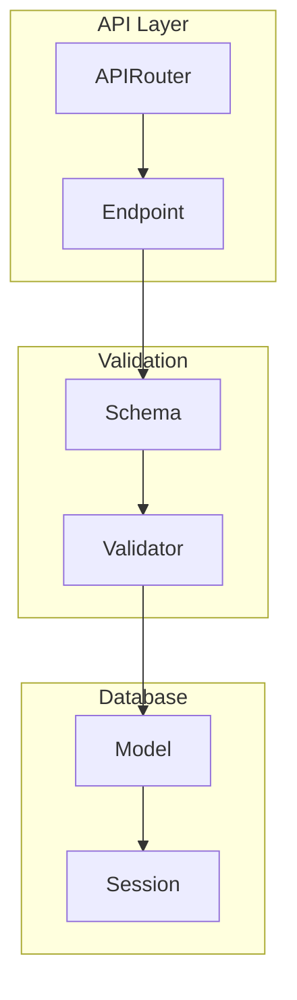

# Visual Diagram Generator Guide

Create publication-quality diagrams from your knowledge graphs. Generate architecture diagrams, dependency flows, community maps, and more—all automatically from graph.json.

---

## Overview

The diagram generator converts your graph into multiple visual formats:

```
graph.json
  ├─→ Mermaid diagrams (flowchart, class, entity-relationship)
  ├─→ SVG force-directed graph (interactive)
  ├─→ ASCII art (terminal-friendly)
  ├─→ Graphviz DOT (high-quality rendering)
  └─→ PlantUML (UML diagrams)
```

Each format is useful for different contexts:

| Format | Best For | Example |
|--------|----------|---------|
| **Mermaid** | GitHub docs, wikis, markdown | Architecture overview |
| **SVG** | Web pages, interactive exploration | Force-directed network |
| **ASCII** | Terminal, commit messages, PRs | Quick reference |
| **Graphviz** | Publication, high-quality output | Complex dependency graph |
| **PlantUML** | UML diagrams, design docs | Class hierarchies |

---

## Quick Start: Generate All Diagrams

```bash
# Generate diagrams from your graph
graphify diagram graph.json --all

# Output:
# diagram-architecture.mmd
# diagram-communities.mmd
# diagram-godpaths.svg
# diagram-dependencies.dot
```

Then convert to images:
```bash
# Mermaid → PNG (requires mermaid-cli)
mmdc -i diagram-architecture.mmd -o diagram-architecture.png

# Graphviz → SVG
dot -Tsvg diagram-dependencies.dot -o diagram-dependencies.svg
```

---

## Part 1: Mermaid Diagram Generator

### Mermaid Architecture Diagram

**Purpose:** Show high-level subsystem organization.

**Command:**
```bash
graphify diagram graph.json --format mermaid --type architecture
```

**Output:** `diagram-architecture.mmd`



**Use cases:**
- Documentation
- Architecture reviews
- Onboarding slides
- GitHub README

**Customize:**
```bash
# Show only critical paths (god nodes)
graphify diagram graph.json --type architecture --god-nodes-only

# Show only a specific community
graphify diagram graph.json --type architecture --community 1
```

### Mermaid Flowchart (Call Flow)

**Purpose:** Trace execution paths through code.

**Command:**
```bash
graphify diagram graph.json --format mermaid --type flowchart --from "authenticate()" --to "database_write()"
```

**Output:**


**Use cases:**
- Debugging flowcharts
- Feature documentation
- Process documentation
- Tutorial walkthroughs

### Mermaid Class Diagram (For OOP Code)

**Purpose:** Show class hierarchies and relationships.

**Command:**
```bash
graphify diagram graph.json --format mermaid --type class
```

**Output:**


**Use cases:**
- UML documentation
- Design reviews
- Class structure documentation

---

## Part 2: SVG Force-Directed Graph Generator

### Interactive Network Diagram

**Purpose:** Browser-based interactive exploration.

**Command:**
```bash
graphify diagram graph.json --format svg --type network
```

**Output:** `diagram-network.svg`

**Features:**
- Click nodes to highlight
- Drag to move
- Zoom with scroll
- Color by community
- Size by degree (importance)

**HTML Embed:**
```html
<!DOCTYPE html>
<html>
<head>
    <title>My Graph</title>
    <style>
        svg { border: 1px solid #ccc; }
        text { font-family: monospace; font-size: 12px; }
    </style>
</head>
<body>
    <h1>Knowledge Graph</h1>
    <!-- Include the SVG -->
    <object data="diagram-network.svg" type="image/svg+xml" width="100%" height="800"></object>
</body>
</html>
```

**Customize:**
```bash
# Show only god nodes
graphify diagram graph.json --format svg --type network --god-nodes-only

# Show specific community with expanded view
graphify diagram graph.json --format svg --type network --community 1 --detail high

# Highlight a specific path
graphify diagram graph.json --format svg --type network --path "authenticate()" "database_write()"
```

### Community Map (Colored Regions)

**Purpose:** Visualize subsystem organization spatially.

**Command:**
```bash
graphify diagram graph.json --format svg --type community-map
```

**Output:** SVG with colored regions per community

```
┌─────────────────────────────────────────────┐
│  Community 0 (HTTP)  │   Community 1 (Data) │
│  HTTPServer Request  │   BaseModel Schema   │
│  Response Middleware │   Validator Entity   │
└─────────────────────────────────────────────┘
     │ (bridges)
┌─────────────────────────────────────────────┐
│     Community 2 (Auth)                      │
│     TokenValidator User Session             │
└─────────────────────────────────────────────┘
```

---

## Part 3: ASCII Art Generator

### Terminal-Friendly Diagrams

**Purpose:** Quick reference in terminal, commit messages, GitHub.

**Command:**
```bash
graphify diagram graph.json --format ascii --type tree
```

**Output:**
```
Root Graph (247 nodes, 8 communities)
├─ Community 0: HTTP Utilities (23 nodes)
│  ├─ ◆ HTTPServer (degree: 24) [god node]
│  ├─ ◆ Request (degree: 18)
│  ├─ Response (degree: 15)
│  └─ [20 more nodes]
├─ Community 1: Data Structures (34 nodes)
│  ├─ ◆ BaseModel (degree: 43) [god node]
│  ├─ ◆ Schema (degree: 22)
│  ├─ Validator (degree: 19)
│  └─ [31 more nodes]
├─ Community 2: Authentication (12 nodes)
│  ├─ ◆ TokenValidator (degree: 12)
│  ├─ User (degree: 8)
│  └─ [10 more nodes]
└─ [5 more communities...]
```

**Use cases:**
- README diagrams
- PR descriptions
- Terminal output
- Documentation

### Dependency Flow (ASCII)

**Command:**
```bash
graphify diagram graph.json --format ascii --type flow --from "upload_handler()" --hops 5
```

**Output:**
```
upload_handler()
  ├─ validates_file()
  │   └─ check_mime_type()
  ├─ saves_to_storage()
  │   └─ storage_service
  │       └─ cloud_api
  ├─ indexes_database()
  │   └─ database.query()
  └─ notifies_user()
      └─ email_service
```

---

## Part 4: Graphviz DOT Generator

### High-Quality Dependency Graph

**Purpose:** Publication-quality diagrams for papers, presentations.

**Command:**
```bash
graphify diagram graph.json --format graphviz --type dependency
```

**Output:** `diagram-dependency.dot`

```dot
digraph Graph {
    graph [rankdir=LR, splines=curved, overlap=false];
    node [shape=box, style=rounded];
    
    "HTTPServer" [fillcolor="#FF6B6B", label="HTTPServer\n(degree: 24)"];
    "Request" [fillcolor="#FF6B6B", label="Request\n(degree: 18)"];
    "BaseModel" [fillcolor="#4ECDC4", label="BaseModel\n(degree: 43)"];
    
    "HTTPServer" -> "Request" [label="uses"];
    "Request" -> "BaseModel" [label="references"];
}
```

**Convert to image:**
```bash
# SVG (vector, scalable)
dot -Tsvg diagram-dependency.dot -o diagram-dependency.svg

# PNG (raster, web-ready)
dot -Tpng diagram-dependency.dot -o diagram-dependency.png

# PDF (for printing)
dot -Tpdf diagram-dependency.dot -o diagram-dependency.pdf
```

**Customize:**
```bash
# Horizontal layout
graphify diagram graph.json --format graphviz --layout lr

# Vertical layout
graphify diagram graph.json --format graphviz --layout tb

# Circular layout
graphify diagram graph.json --format graphviz --layout circo

# Highlight community (color-coded)
graphify diagram graph.json --format graphviz --highlight-communities
```

---

## Part 5: PlantUML UML Diagrams

### Class Hierarchy Diagram

**Purpose:** UML-style class and interface diagrams.

**Command:**
```bash
graphify diagram graph.json --format plantuml --type class-hierarchy
```

**Output:** `diagram-uml.puml`



**Convert to image:**
```bash
# Using PlantUML online (no install needed)
curl -X POST -d @diagram-uml.puml https://www.plantuml.com/plantuml/png/
```

---

## Part 6: Custom Diagram Scripts

### Python Script: Generate Custom SVG

```python
# Save as generate_custom_diagram.py

import json
from pathlib import Path
import xml.etree.ElementTree as ET

def generate_custom_svg(graph_json_path: Path, output_path: Path):
    """Generate a custom SVG from graph.json."""
    
    with open(graph_json_path) as f:
        graph = json.load(f)
    
    # Create SVG root
    svg = ET.Element('svg', {
        'width': '1200',
        'height': '800',
        'xmlns': 'http://www.w3.org/2000/svg'
    })
    
    # Add styles
    style = ET.SubElement(svg, 'style')
    style.text = """
        .node { fill: #3498db; stroke: #2c3e50; stroke-width: 2; }
        .god-node { fill: #e74c3c; }
        .text { font-family: monospace; font-size: 12px; fill: white; }
        .edge { stroke: #95a5a6; stroke-width: 1.5; }
    """
    
    # Plot nodes (simple grid for now)
    nodes = graph['nodes']
    x_spacing = 1200 / (len(nodes) // 10 + 1)
    y_spacing = 800 / 10
    
    for i, node in enumerate(nodes[:100]):  # First 100 for demo
        x = (i % 12) * x_spacing + 50
        y = (i // 12) * y_spacing + 50
        
        # Determine node class
        node_class = "node"
        if node.get('degree', 0) > 20:
            node_class = "god-node"
        
        # Draw circle
        circle = ET.SubElement(svg, 'circle', {
            'class': node_class,
            'cx': str(x),
            'cy': str(y),
            'r': str(5 + node.get('degree', 1) / 10)
        })
        
        # Add label
        text = ET.SubElement(svg, 'text', {
            'class': 'text',
            'x': str(x - 20),
            'y': str(y + 25),
            'text-anchor': 'middle'
        })
        text.text = node['label'][:15]  # Truncate long names
    
    # Write SVG
    tree = ET.ElementTree(svg)
    tree.write(output_path)
    print(f"Generated {output_path}")

if __name__ == "__main__":
    generate_custom_svg(
        Path("graphify-out/graph.json"),
        Path("diagram-custom.svg")
    )
```

**Run it:**
```bash
python generate_custom_diagram.py
open diagram-custom.svg
```

---

## Part 7: Embedding Diagrams in Documentation

### In Markdown
```markdown
# Architecture


## Call Flow



## Dependencies

<embed src="diagram-network.svg" type="image/svg+xml" />
```

### In HTML
```html
<section id="architecture">
    <h2>System Architecture</h2>
    <figure>
        <svg data-src="diagram-network.svg"></svg>
        <figcaption>Interactive knowledge graph</figcaption>
    </figure>
</section>
```

### In Jupyter Notebooks
```python
from IPython.display import SVG, display, Markdown

# Display SVG diagram
display(SVG("diagram-network.svg"))

# Display Mermaid in markdown
display(Markdown("""

"""))
```

---

## Part 8: Diagram Gallery & Examples

### Example 1: FastAPI-like Structure

```bash
graphify diagram fastapi-graph.json --format mermaid --type architecture > fastapi-arch.mmd
```

**Output:**


### Example 2: Django Project

```bash
graphify diagram django-graph.json --format graphviz --layout lr > django-deps.dot
dot -Tpng django-deps.dot -o django-deps.png
```

### Example 3: Microservices Architecture

```bash
graphify diagram microservices-graph.json --format svg --type community-map --highlight-communities
```

---

## Part 9: Automation & CI Integration

### Generate Diagrams on Every Commit

**.github/workflows/diagrams.yml:**
```yaml
name: Generate Diagrams

on: [push]

jobs:
  diagrams:
    runs-on: ubuntu-latest
    steps:
      - uses: actions/checkout@v3
      
      - name: Install graphify
        run: pip install graphifyy
      
      - name: Generate graph
        run: graphify . --out graphify-out
      
      - name: Generate diagrams
        run: |
          graphify diagram graphify-out/graph.json --format mermaid --type architecture
          graphify diagram graphify-out/graph.json --format graphviz --type dependency
          graphify diagram graphify-out/graph.json --format ascii --type tree
      
      - name: Commit diagrams
        run: |
          git add diagram-*.mmd diagram-*.dot diagram-*.txt
          git commit -m "Update diagrams" || true
          git push
```

### Generate Before PR

```bash
# Local script
#!/bin/bash
graphify . --out graphify-out
graphify diagram graphify-out/graph.json --format mermaid --type architecture
graphify diagram graphify-out/graph.json --format svg --type network

git add diagram-*.mmd diagram-*.svg
```

---

## Part 10: Advanced: Custom Diagram Plugins

### Write Your Own Diagram Generator

```python
# graphify/diagrams/custom.py

class CustomDiagramGenerator:
    def __init__(self, graph_data: dict):
        self.graph = graph_data
    
    def generate_timeline(self):
        """Generate a timeline of dependencies."""
        # Implement your custom logic
        pass
    
    def generate_heatmap(self):
        """Generate a heatmap of node connectivity."""
        # Implement your custom logic
        pass

# Register with graphify
# graphify diagram graph.json --format custom --type timeline
```

---

## Reference: Diagram Types

```
┌─────────────────────────────────────────┐
│ ARCHITECTURE                            │
│ Subsystem organization, high-level view │
└─────────────────────────────────────────┘

┌─────────────────────────────────────────┐
│ FLOWCHART                               │
│ Trace execution paths, call flows       │
└─────────────────────────────────────────┘

┌─────────────────────────────────────────┐
│ CLASS HIERARCHY                         │
│ OOP relationships, inheritance          │
└─────────────────────────────────────────┘

┌─────────────────────────────────────────┐
│ DEPENDENCY                              │
│ Module dependencies, coupling           │
└─────────────────────────────────────────┘

┌─────────────────────────────────────────┐
│ COMMUNITY MAP                           │
│ Subsystems as spatial regions           │
└─────────────────────────────────────────┘

┌─────────────────────────────────────────┐
│ NETWORK                                 │
│ Force-directed interactive graph        │
└─────────────────────────────────────────┘

┌─────────────────────────────────────────┐
│ TREE                                    │
│ Hierarchical text view                  │
└─────────────────────────────────────────┘

┌─────────────────────────────────────────┐
│ TIMELINE                                │
│ Call sequence, step-by-step flow        │
└─────────────────────────────────────────┘
```

---

## Tips & Tricks

1. **For presentations:** Use Mermaid or Graphviz (PNG/PDF)
2. **For documentation:** Use Mermaid in Markdown or embedded SVG
3. **For exploration:** Use interactive SVG graphs
4. **For terminals:** Use ASCII art
5. **For papers:** Use high-resolution Graphviz output
6. **For teaching:** Use step-by-step flowcharts

---

Next: [Interactive Examples](INTERACTIVE_EXAMPLES.md) to run and tinker with!
